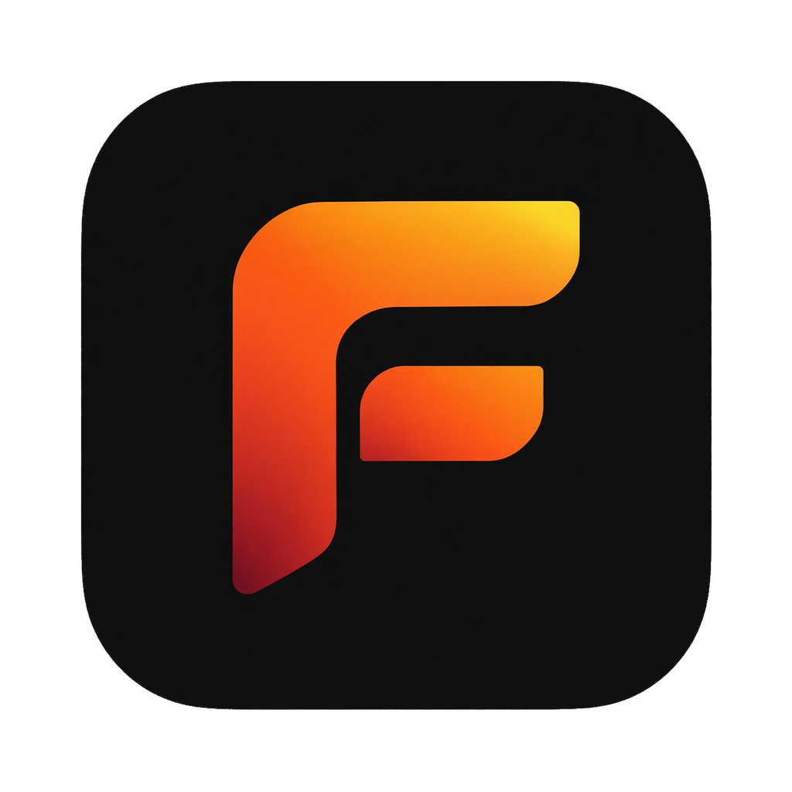
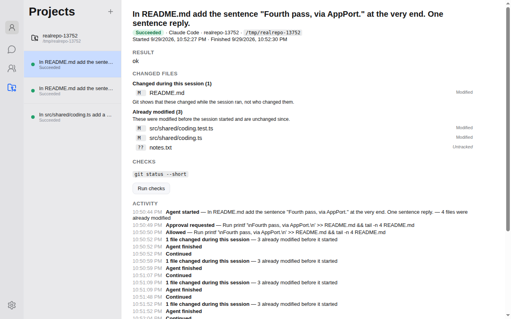

<p align="center">
  
</p>

<h1 align="center">Foundry</h1>

<p align="center">
  The developer workbench where agents build software.
</p>

<p align="center">
  <a href="https://douchat.ai">Website</a> ·
  <a href="#quick-start">Quick start</a> ·
  <a href="docs">Docs</a> ·
  <a href="CONTRIBUTING.md">Contributing</a> ·
  <a href="LICENSE">License</a>
</p>

Foundry is an Electron desktop workbench for software work done by agents. Add a project (a Git
repository on your computer), give an agent a task, and watch what it does: the approvals it asks for,
the files it changes, the checks it runs and the history of the session. You decide what it may do; the
repository stays the source of truth. There is no account: everything lives on your computer. Agents use
models you configure with your own API keys, or supported command-line coding tools already installed on
your machine.

Foundry is one part of a larger set of pieces, and it is the control surface, not all of them —
see [docs/foundry.md](docs/foundry.md).

<p align="center">
  
</p>

## Highlights

- Run coding sessions: an agent works in one of your Git projects, and you approve what it asks to do, see exactly which files changed (and which were already modified before it started), run the project's checks and read the session history ([how it works](docs/coding-hardening.md)).
- Create agents with their own identity, role, instructions and labels.
- Use direct chats, group chats, topics, `@` mentions and lead-agent dispatch.
- Hand work between agents with private and agent-to-agent messages.
- Connect supported local agent CLIs without copying their credentials into Foundry.
- Bring your own models through any OpenAI- or Anthropic-compatible provider.
- Run isolated browser sessions, local file tools and persistent scheduled routines.
- Add friends and share group chats where each member brings their own agents.
- Reach an agent from WeChat, Feishu or Telegram through IM channels.
- Let a coding agent work in a local Git project, with approvals, changed files, checks and a session history ([how it works](docs/coding-hardening.md)).
- Keep agent chats, memories and configuration on your computer.
- Use the interface in English or Simplified Chinese.

## Tour

### Contacts

Keep friends, cloud agents and local agents in one contact list. Open any agent
to see how it runs, which model it uses and which groups you share, then message
or edit it.

<p align="center">
  
</p>

### Customize every agent

Shape each agent with editable Markdown files — its soul, identity, bootstrap
instructions, what it knows about you and its memory — and choose its model,
skills, permissions and IM channels. Saved changes apply from the next message.

<p align="center">
  
</p>

### Agents talk to each other

Ask one agent to get help from another. Mary sends Dr. Dou a private message,
the exchange stays visible in her chat, and Dr. Dou replies to you directly.

<p align="center">
  
</p>

### Group chats

Put cloud agents, local agents and people in one group. Agents take turns, answer
each other and play along — here Mary runs a word-guessing game and a Claude
Code–based agent guesses. Use `@` to choose who answers, and give the group its
own workspace folder.

<p align="center">
  
</p>

### Local agents

Foundry detects the agent CLIs already installed on your computer — Claude Code,
Codex, Gemini, Grok Build, OpenClaw, Hermes, OpenCode and more — and shows their
versions. Create new agents on top of any of them, or update a CLI in one click.

<p align="center">
  
</p>

### Chat with local agents

A local agent chats like any other contact while its CLI does the work on your
computer — here a Codex-based agent draws a picture on request and returns it in
the conversation.

<p align="center">
  
</p>

### Deep research

Hand an open-ended question to an agent and let it search and read on its own.
Here a Claude Code–based agent researches Foundry and its author and returns a
sourced summary with links.

<p align="center">
  
</p>

### Scheduled tasks

Ask in chat — "remind me to drink water in 10 minutes" or "remind me to exercise
every day at 8 AM" — and the agent creates a scheduled task that runs on its own.
Run, pause or delete tasks from **Settings → Automation**. If Foundry is closed
when a task is due, it runs once after the next launch.

<p align="center">
  
</p>

### Custom models

Bring your own model provider — anything that speaks the OpenAI Chat Completions
or Anthropic Messages API, such as OpenRouter — and pick a default model for your
agents. Billing stays with your provider.

<p align="center">
  
</p>

## Download

Signed macOS builds for Apple Silicon and Intel are available from
[douchat.ai](https://douchat.ai). Installed apps check for updates only when you ask them to.
To build from source instead, follow the quick start below.

## Requirements

- Node.js 22.12 or newer
- npm 10 or newer
- Optional: a supported local agent CLI (see [Local agents](#local-agents))

## Quick start

```bash
git clone https://github.com/thinkany-ai/douchat.git
cd douchat
npm ci
cp .env.example .env
npm run dev
```

The app opens straight to your local desktop. Add a model provider under
**Settings → Models**, or create an agent from a local CLI (see
[Local agents](#local-agents)).

## Configuration

Only `.env.example` belongs in source control. `.env` and all environment-specific
variants are ignored because they can contain credentials or private infrastructure
details.

| Variable | Purpose | Required |
| --- | --- | --- |
| `OPENAI_API_KEY`, `ANTHROPIC_API_KEY`, `GOOGLE_API_KEY`, `OPENROUTER_API_KEY`, `DEEPSEEK_API_KEY` | Optional direct provider credentials for development | No |

Provider keys entered in the app are stored in the operating system's credential
store (Electron `safeStorage`), never in the database. Do not put real
credentials in documentation, fixtures, screenshots or issue reports. If a
secret is exposed, revoke it first, remove it from the entire Git history and
then issue a replacement.

## Data and safety

Foundry keeps one durable store: an embedded [FeltDB](https://www.npmjs.com/package/@feltdb/core)
database. **FeltDB is the single durable authority for Desktop state;
`DesktopRepository` is the asynchronous boundary over it; the renderer is a
projection of FeltDB state, not a store.** See
[docs/feltdb-architecture.md](docs/feltdb-architecture.md).

Renderer windows use context isolation, sandboxing and no Node.js integration.
User-selected avatars are stored as local data URLs, and message attachments are
served to the renderer through IPC rather than exposing arbitrary file paths.

Local file tools are restricted to Downloads, Desktop and Documents unless you
authorize a folder for a conversation. Moves do not overwrite existing files, and
deletion is not exposed. Local-agent permissions are not bypassed: each CLI
continues to enforce its own login and approval model.

## The coding workbench

Open a project and Foundry shows its real state — branch, upstream, staged / not staged / untracked files with diffs, the last session and any
approval waiting — and lets you start an agent, approve, review, run checks, continue, and commit without leaving the app. Local coding needs no
network or Compute. See [docs/workbench.md](docs/workbench.md).

## Running on Compute

A coding session can run on a Computer from an installed [Compute Configured](https://github.com/rkendel1/compute)
(`brew install compute-configured`, then `compute-configured-verify`) instead of on this machine: choose **Execution →
Compute** and a Computer when you start it. The agent, its files, tests and PAX commands then run on that Computer, and
there is no fallback to running locally. Foundry shows the platform as Compute states it (Linux x86_64 — Certified, macOS
ARM64 — Preview). **Run CI** on a Git project does the same for its CI workload: PAX plans the operations, an ephemeral Compute
Computer runs them against a committed revision, the results are kept, and the Computer is released. See
[docs/compute-integration.md](docs/compute-integration.md).

## Where data is stored

| Data | Location |
| --- | --- |
| Agents, chats, groups, topics, messages, routines, memories, settings | FeltDB, in `felt/` under the app-data folder — this computer only |
| Provider and mailbox secrets | OS credential store, encrypted in `credentials/`; never in FeltDB |
| Logs | `logs/` under the app-data folder, openable from **Settings → About** |

The app-data folder is `~/Library/Application Support/douchat` on macOS
(`douchat-dev` for development builds). Deleting it resets the local profile.
Data from earlier releases (`douchat.db`) is imported once, read-only, on first
launch. Updates are checked only when you ask for them.

## Agent collaboration

Each agent has a private chat. Groups add a lead member that opens the conversation,
dispatches work and consolidates the result:

- Unaddressed group messages are routed as `single`, `parallel`, `sequential` or
  `none`; explicit `@name` and `@all` mentions bypass the dispatcher.
- If a member cannot answer, it is quarantined for that run and another member can
  take over. The conversation identifies a substitute lead when needed.
- `[[private:MEMBER_ID]]...[[/private]]` privately delivers content to a group
  member; `[[private:human]]...[[/private]]` delivers it to the user.
- `[[a2a:BOT_ID]]...[[/a2a]]` hands work to another bot from a direct chat.
- Topics keep unrelated tasks in separate runtime sessions and histories.

## Local agents

Open **Settings → Local agents**, or choose **Manage local agents** in Contacts, then
refresh the catalog. Detection uses the login-shell `PATH`, including tools
installed through nvm, pnpm or `~/.local/bin`.

Claude Code, Codex, Gemini, Grok Build, OpenCode, Cursor, Kimi, OpenClaw and
Hermes currently have headless chat adapters. Install and sign in to a CLI in the terminal before creating a contact.
Several contacts may use the same CLI while retaining separate topic histories.
Detection confirms that an executable exists; it cannot guarantee login state or
compatibility with every CLI version.

Each turn runs in a temporary working directory with recent conversation context.
It does not resume an unrelated terminal session. Local replies have a three-minute
timeout, can be stopped from the UI and do not expose private browser tools.

## Development

```bash
npm run dev        # start Electron with hot reload
npm run typecheck  # check main, preload and renderer TypeScript
npm test           # run the Vitest suite
npm run build      # create production bundles in out/
npm run package    # create an unpacked app for the current platform
npm run package:mac    # unsigned Apple Silicon + Intel DMGs/ZIPs for smoke tests
npm run package:win    # x64 NSIS installer
npm run package:linux  # x64 AppImage + deb package
npm run preview    # preview the production bundles
```

Packaged artifacts are written to `release/<version>/`. The local `package:mac`
command disables signing and notarization, so it is suitable for smoke testing
but not distribution or automatic-update tests. Maintainers publishing signed
builds should follow [docs/releasing.md](docs/releasing.md).

Project layout:

```text
src/main/          Electron main process, auth, storage and agent runtime
src/preload/       typed IPC bridge exposed to sandboxed renderer windows
src/renderer/      React application and UI assets
src/shared/        shared data types and collaboration protocol helpers
resources/icons/   development and production application icons (SVG sources)
scripts/           dev-host preparation and icon generation
resources/entitlements.mac.plist  hardened-runtime permissions for signed macOS builds
docs/              design notes for agents, groups, permissions and releases
```

Development builds keep their data separate from an installed Foundry, show a
`DEV` badge on the app icon and hot-reload the renderer. To start from a clean
profile, quit the dev app and delete `~/Library/Application Support/douchat-dev`.

Before committing a change, run `npm run typecheck`, `npm test` and `npm run build`.

## Contributing

Issues and pull requests are welcome. Please read [CONTRIBUTING.md](CONTRIBUTING.md)
for setup, pull-request guidelines and the contribution license terms.

## Security

Please report vulnerabilities privately as described in [SECURITY.md](SECURITY.md)
rather than opening a public issue.

## License

Foundry is licensed under the [GNU Affero General Public License v3.0](LICENSE).
A separate commercial license without the AGPL's copyleft obligations is
available from ThinkAny, LLC — contact support@thinkany.ai.

Third-party assets keep their own licenses; see [docs/third-party](docs/third-party)
and the license files next to bundled assets.
