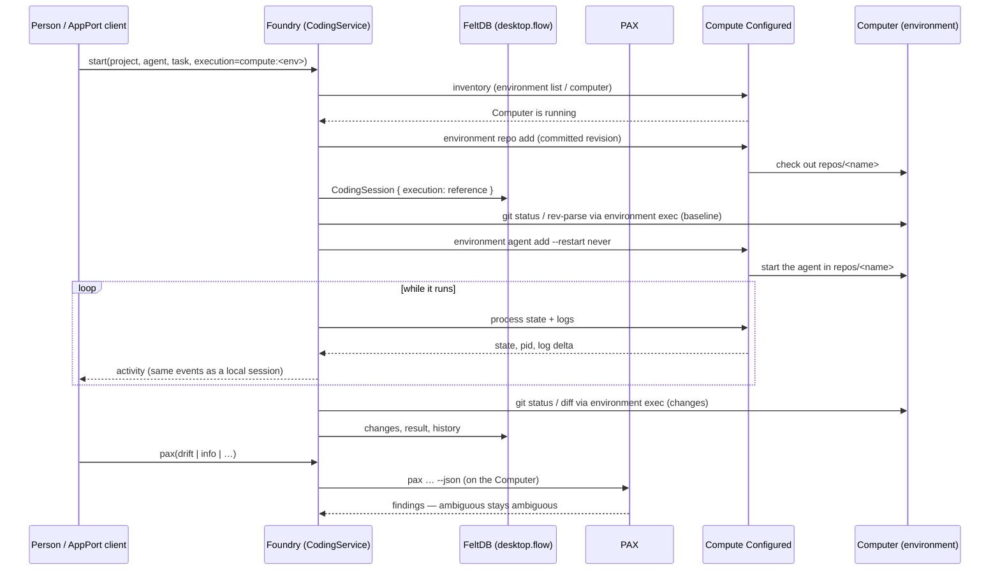

# Foundry coding sessions on Compute Configured

A coding session can run on a **Computer** owned by the installed Compute Configured product instead of on this
machine:

```text
Foundry → PAX → Compute Configured → a real Computer → the coding agent
```

Foundry is the workbench. PAX is the project-tooling boundary. Compute owns the Computer, its environment and its
processes. Foundry adds no Compute protocol of its own: it calls the commands and API Compute already ships.

## 1. Audit: the seam

Read before any code was written (Compute 0.1.5, PAX, the Homebrew tap, Foundry's coding path):

| Question | Finding |
| --- | --- |
| How is Compute driven? | `compute-configured` is a wrapper (it sets `COMPUTE_STACKS`) over `compute`. Every operation is a CLI verb with `--json`; the same operations are on the daemon API (`compute start`, default `127.0.0.1:8787`, UI at `/ui/`). |
| What is a Computer? | An **environment** (`compute environment create`), durable, hosted by a *target* — `this-machine` provides a workspace. Repositories are checked out under `repos/<name>` in the Computer's workspace. |
| How does work run on it? | `environment exec` (a one-shot command in a repository), `environment agent add` (a supervised process, `--restart never`), `environment process/logs`, `environment computer` (observed state). |
| What does Compute report? | Reality `running` / `unreachable` / `lost`; per-process state, pid and, when it knows it, `last_failure.exit_code`. |
| Where does PAX fit? | Compute discovers a project with PAX (`COMPUTE_PAX`); `pax info/doctor/reality/drift/build/test/lint/typecheck/run/exec` accept `--json` and `--dry-run`. PAX inspects; delegated operations run the project's own native tool. |
| Where does Foundry's coding path already end? | At a `ChildProcess`-shaped agent (`localAgentRuntime`) and at `git` run through the no-shell command runner. |

**The seam** is therefore two small adapters behind interfaces Foundry already had, and nothing else:

* `src/main/compute/client.ts` — `ComputeClient`, one documented Compute CLI call per method.
* `src/main/compute/launcher.ts` — `ComputeChild` presents a Compute agent process as the child the local-agent runtime
  already consumes (stdout, stderr, `close`, `stop`), injected through `runtime.setLaunchResolver`.
* `src/main/coding/git.ts` — `RemoteGit` runs the same git commands on the Computer through `environment exec`, so
  baseline, changed-file accounting and diffs are computed where the files are.
* `src/main/compute/pax.ts` — runs `pax` on the Computer and classifies what it says.

Nothing in the coding loop, the approval broker, history or the change accounting was forked.

## 2. Boundaries

| Owner | Owns | Does not own |
| --- | --- | --- |
| **Foundry** | Project, CodingSession, approvals, history, changed-file accounting, Git state (read), the choice of Local or Compute | Computers, environments, processes, PAX's decisions |
| **PAX** | What the project is: package manager, declared/resolved/installed evidence, drift, the native command a delegated operation runs | Where it runs; Foundry's sessions |
| **Compute** | The Computer, its environment and workspace, its processes, their logs and state | Sessions, approvals, source authority |
| **FeltDB** | One shared `desktop.flow`: Foundry's collections, AppPort Services' and `@appport/github`'s. A session stores a *reference* to a Computer (`execution`: kind, environment name/id, repository name) | Source, Computer state, tokens |
| **Repository / filesystem** | Source. The Computer holds a checkout of the committed revision; the change is observed there with Git | — |
| **AppPort** | The transport for the same `CodingService`; two additions, `douchat.coding.compute.inventory` and `douchat.coding.sessions.pax` (read-only inspections) | A new authority; any remote filesystem or exec |

No second `.flow`, cache, registry or event bus was added. Foundry never reads Compute's state directory, and does not
read other applications' collections. The Computer list is asked of Compute every time it is shown.

## 3. Sequence



## 4. Lifecycle

1. **Choose.** Execution is Local (default) or Compute. For Compute, Foundry lists Computers from Compute's inventory and
   the person chooses one; **Open Compute** opens Compute's own UI, and there is only one Computer.
2. **Start.** The Computer must be `running`. Foundry has Compute check out the project's *committed* revision as a
   repository on it. Uncommitted local files are **not** on the Computer; the session says so in its history.
3. **Run.** The agent is a Compute process in that checkout. Its cwd, filesystem, processes, tools and tests are the
   Computer's. Foundry polls Compute for state and log output and feeds the same activity a local run produces.
4. **Checks.** `Run checks` and PAX commands run on the Computer (`environment exec`), never here.
5. **Finish.** The exit code Compute reports decides succeeded/failed. Foundry reads the changed files with Git *on the
   Computer* and stores the session in FeltDB.
6. **Continue.** As for local sessions, a continuation starts a new agent process; nothing is resumed.
7. **Cancel.** Foundry asks Compute to stop the process; the session says cancelled only after it did.

## 5. Local vs Compute

| | Local | Compute |
| --- | --- | --- |
| Agent process | Started by Foundry, tracked in the process ledger | A Compute process on the Computer; the ledger records none |
| Files | The project directory | The Computer's checkout of the committed revision |
| Git / changed files | Local `git` | `git` on the Computer via `environment exec` |
| Tests, PAX | Local | On the Computer |
| Approvals | Runtime permission broker | Same broker; the Compute path uses one-shot agents (custom, Claude one-shot) — approvals inside the agent are not routed |
| Fallback | — | **None.** If Compute or the Computer is unavailable the session fails or is interrupted; it never runs locally instead |

## 6. Platforms

Foundry states what Compute states, from `compute-configured-verify`'s evidence for the installed distribution.

| Platform | Label | Basis |
| --- | --- | --- |
| Linux x86_64 | **Linux — Certified** | Compute's `certified` for `compute-configured-0.1.5-linux-x86_64` |
| macOS ARM64 | **macOS — Preview** | Compute's `preview` for `compute-configured-0.1.5-macos-aarch64` |
| anything else, or no statement | Unverified | — |

A workload succeeding is never taken as certification, and the label is never inferred from behavior.

**Evidence, stated plainly.**

* The full real-product suite (`src/main/compute/compute.test.ts`) ran on **Linux x86_64** against Compute Configured
  0.1.5 (`compute-configured-verify` status: certified): a real daemon, environment, Computer, PAX binary and agent.
* **macOS was not executed.** No macOS ARM64 machine was available. What is tested for macOS is the label, read from the
  distribution evidence Compute ships for `macos-aarch64` (`certification_status: preview`); the fixtures are in
  `src/main/compute/fixtures/`. Running the same suite there is the missing evidence.
* Homebrew was unavailable in the build container, so Compute Configured 0.1.5 and PAX were installed from the tap's
  formula-pinned, sha256-verified release archives, laid out as Homebrew lays them out. `brew install compute-configured`,
  `compute-configured-verify` and `compute-configured-setup` are the supported path; the tests find the binary on PATH, in the
  Homebrew prefixes or via `FOUNDRY_COMPUTE` / `FOUNDRY_PAX`, and skip (reported as skipped) where it is not installed.

Foundry installs no other binary and downloads no runtime.

## 7. Failure semantics

| Situation | Foundry does |
| --- | --- |
| Compute not installed / daemon down | Says so, with the install command; starts nothing; no local fallback |
| Runtime mismatch (the project needs a platform the providers cannot meet) | Compute's placement result is shown as Compute states it; nothing is substituted |
| PAX ambiguity (two package managers) | `drift` reports `ambiguous`; `pax test` fails closed. Foundry does not choose a tool |
| Drift (declared/resolved but not installed) | Reported (exit 1); nothing repairs or installs it. Unknown is not drift |
| Agent or delegated command fails | Session `failed`; Compute's exit code and the log tail are the error |
| Cancelled | Process stopped through Compute; session `cancelled` |
| Computer disconnects | Session `interrupted` ("the Computer stopped answering"), not completed. A terminal process report with no exit status is treated the same way — Foundry does not invent one |

## 8. Persisted vs ephemeral

| Persisted (FeltDB) | Ephemeral / elsewhere |
| --- | --- |
| Session, task, status, history, changes, commands, result | The agent process (Compute's) |
| `execution`: `kind`, `environment`, `environmentId`, `repository` | Computer state, inventory, logs (asked of Compute) |
| Approvals and their outcomes | The checkout on the Computer (Compute's workspace) |
| — | Source (the repository) and credentials (never in FeltDB) |

## 9. Known limits (findings, not fixed here)

* `pax` here reports 0.1.0 while its source is 0.2.0. PAX drift/reality is presence-level; `--live` adds no runtime drift.
* Under contradictory lockfiles `pax info` selects a manager by lockfile precedence while `pax test` fails closed and
  `drift` says ambiguous. Foundry shows each as PAX says it.
* Compute agent processes are service-style: an instant exit reports `start_failed` with exit 0; the reported pid is the
  agent's parent; a stalled target reports no exit code.
* `environment exec` jobs cannot be cancelled through the CLI, so a running check on a Computer is not cancellable beyond
  ending Foundry's call.
* The `local` provider here cannot enforce `network none`.
* The agent CLI and PAX must exist on the Computer; the `this-machine` target shares this host's PATH.
* Uncommitted local changes are not on the Computer.
* One Computer per session; no multi-Computer orchestration, no Computer replacement.

## 10. Tests

`src/main/compute/compute.test.ts` drives the installed product (isolated `COMPUTE_HOME`, its own daemon, a real
environment per test): the platform statement; a full session (agent cwd on the Computer, processes as Compute reports
them, PAX, edit and tests there, local repository untouched, Compute's API and UI showing the same Computer, no local agent
in the ledger, only a reference stored); PAX ambiguity and drift; unmet runtime requirement; failing command;
cancellation; Computer disconnect; and the same session through AppPort. Set `FOUNDRY_COMPUTE` and `FOUNDRY_PAX` to
point at an install outside the usual places.
